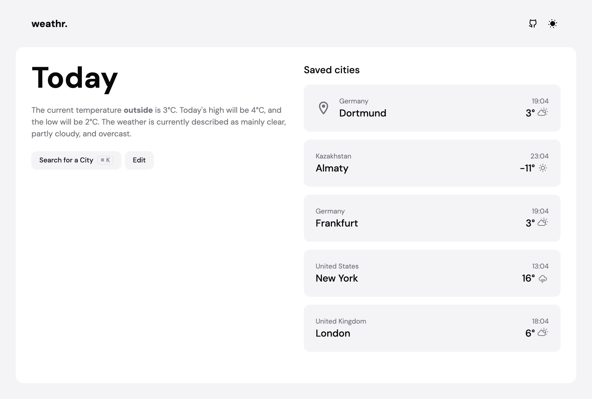

# weathr.

A minimalist weather application built with Nuxt 3 that provides clean, simple weather information for multiple cities worldwide.

## Features

- **Real-time Weather Data**
  - Current temperature and conditions
  - Hourly forecasts
  - 7-day weather outlook

- **Location Management**
  - Search and save multiple cities
  - Automatic current location detection
  - Quick city switching
  - Simple city editing and removal

- **User Experience**
  - Clean, minimalist interface
  - Dark/Light/System theme support
  - Smooth page transitions 
  - Keyboard shortcuts (⌘+K for search)
  - Responsive design

## Tech Stack

- **Framework**: [Nuxt 3](https://nuxt.com/)
- **State Management**: [Pinia](https://pinia.vuejs.org/)
- **UI Components**: [shadcn-vue](https://www.shadcn-vue.com/)
- **CSS Framework**: [TailwindCSS](https://tailwindcss.com/)
- **APIs**:
  - [OpenMeteo](https://open-meteo.com/) for weather data
  - [Nominatim](https://nominatim.org/) for city data

## Development

```bash
# Install dependencies
pnpm install

# Start dev server
pnpm dev

# Build for production
pnpm build

# Preview production build
pnpm preview
```

## Environment Variables

None required! The app uses free public APIs.

## Project Structure

```
├── app.vue              # App entry
├── components/         
│   ├── ui/             # Shadcn components
│   └── weather/        # Weather-specific components
├── composables/        # Shared composable functions
├── pages/              # Application routes
└── types/              # TypeScript definitions
```

## License

MIT

---

This modern weather dashboard focuses on simplicity and usability while providing comprehensive weather data in a clean interface.